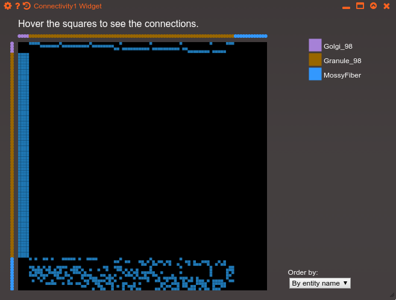
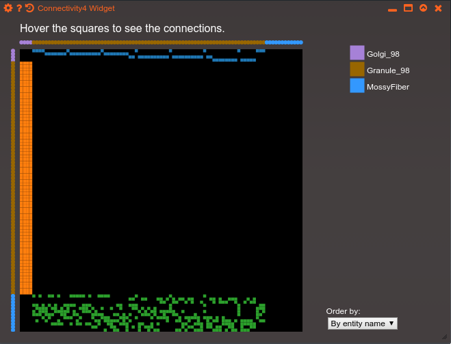
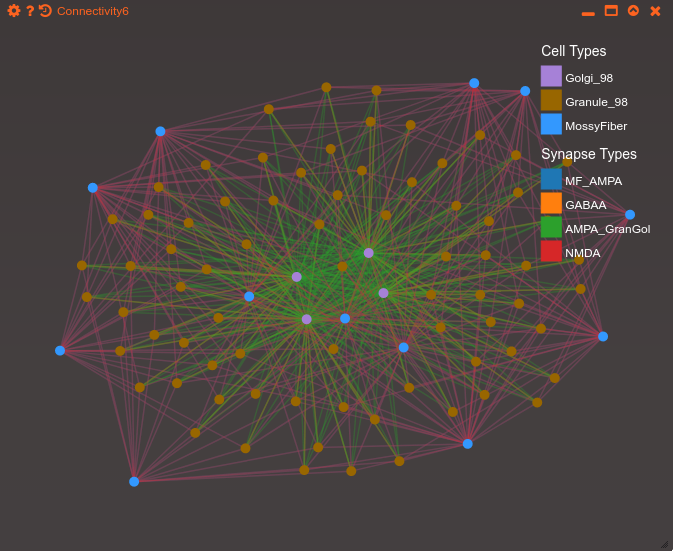
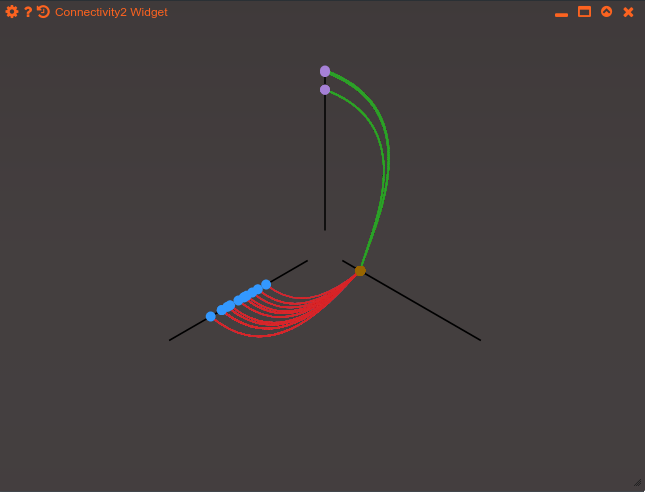
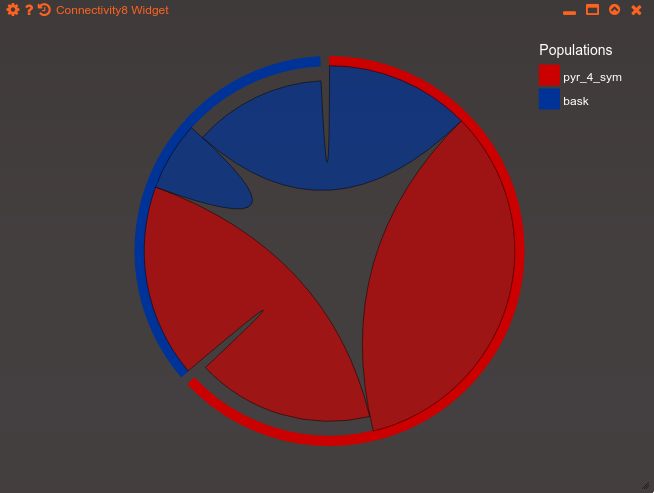

Connectivity Widget
===================

The Connectivity Widget provides different ways to visualize connections
between model entities. Data is bound to the widget by invoking the
`setData(entity[, options])` method. The way information is displayed is
controlled via the *layout* field in the *options* object. Currently,
four layouts are supported:

-   'matrix' (default): Connectivity Matrix\_
-   'force': Force-directed layout\_
-   'hive': Hive Plot\_
-   'chord': Chord Plot\_

Each one of the options is detailed below.

Layout agnostic options
-----------------------

After creating an instance of the Connectivity widget with
`G.addWidget(GEPPETTO.Widgets.CONNECTIVITY)`, data must be bound to it
using the `setData()` method, which applies to any of the layouts.
Additional options for the same method can be used to control visual
attributes -- such as mapping link/node categories onto colours or node
weights onto line widths -- in the following manner:

The `setData(entity[, options])` method accepts two arguments:

-   *entity* (mandatory): the entity whose connections will be plotted.
-   *options* (optional): an object, containing one or more of the
    following keys:
    -   *layout*: one of \['matrix', 'hive', 'force', 'chord'\].
        Defaults to 'matrix'.
    -   *library*: a Geppetto library, e.g.
        `GEPPETTO.ModelFactory.geppettoModel.neuroml` that supplies a
        `network` type.
    -   *linkType*: a function that maps each connection *edge* (object
        of class
        [ConnectionNode](https://raw.githubusercontent.com/openworm/org.geppetto.frontend/development/src/main/webapp/js/nodes/ConnectionNode.js))
        onto *any* type of value (coercible to string) which
        qualitatively identifies the link category. Defaults to
        `function(link): {return 1}` (i.e., all links are of same
        'type' 1). Applies to *matrix*, *force*, *hive* views.
    -   *linkWeight*: a function that maps each connection *edge*
        (object of class
        [ConnectionNode](https://raw.githubusercontent.com/openworm/org.geppetto.frontend/development/src/main/webapp/js/nodes/ConnectionNode.js))
        onto a Floating point number, which represents the
        connection weight. Defaults to `function(link): {return 1}`
        (i.e., all links are of same 'weight' 1, and will be e.g. be
        drawn as lines with the same width in the *force* view.
    -   *nodeType*: a function that maps the connection *source node*
        (object of class
        [EntityNode](https://raw.githubusercontent.com/openworm/org.geppetto.frontend/development/src/main/webapp/js/nodes/EntityNode.js) )
        onto *any* type of value (coercible to string) which
        qualitatively identifies the node category. Defaults to
        `function(node): {return node.getId().split('_')[0]}` (i.e.,
        nodes are classified according to part of their 'id' field
        before the first '\_' character). Applies to *force*,
        *hive* views.
    -   *colorMapFunction*: a function returning a [d3
        scaleOrdinal](https://github.com/d3/d3-scale/blob/master/README.md#scaleOrdinal),
        called when a `Color_set` event is raised.

Connectivity Matrix
-------------------

Draws a square [matrix](http://en.wikipedia.org/wiki/Adjacency_matrix),
where each row \[column\] correspond to a source \[target\] node.
Therefore, filled squares at *i,j* denote a directed edge from node *i*
to node *j*. The rows/columns can be sorted by node name, number of
incoming connections, and number of outgoing connections. Circles above
each row/column indicate the type of nodes in that row/column. Hover
over to see node or type names, click to select the corresponding cells
in the Geppetto 3D view.

### Example 1

Connectivity widget for a cerebellar [granule cell layer
model](http://opensourcebrain.org/projects/grancelllayer). It defaults
to a vanilla matrix if no options are specified:

    G.addWidget(GEPPETTO.Widgets.CONNECTIVITY).setData(network_GranCellLayer);

### Example 2

Using the *linkType* option to colour links (synapses) by
neurotransmitter in a model of the [auditory
cortex](http://opensourcebrain.org/projects/acnet2). The *linkType*
function leverages the *getAllVariablesOfType* method, in order to get
NeuroML synaptic properties, which in turn have and id attribute which
indicates the neuromodulator (and the population, which is irrelevant in
this case). The name is finally split at the underscore to get only
AMPA/GABA. :

    G.addWidget(GEPPETTO.Widgets.CONNECTIVITY).setData(MediumNet,
        {linkType: function(l) {
                       var synapseType = GEPPETTO.ModelFactory.getAllVariablesOfType(l.getParent(), GEPPETTO.ModelFactory.geppettoModel.neuroml.synapse)[0];
                       if (synapseType != undefined)
                           return synapseType.getId();
                       else
                           return l.getName().split("-")[0];
                   }
        });

Force-directed layout
---------------------

Draws circles for each node, connected by lines for each edge. Node /
link colours and line widths can be customized via the *nodeType*,
*linkType*, *linkWeight* mappings respectively. Nodes repel each other
([force
directed](http://en.wikipedia.org/wiki/Force-directed_graph_drawing)) in
order to reduce clutter, and can be interactively dragged. Hover over to
see the node name.

### Example 1

Default force layout for the cerebellar [granule cell layer
model](http://opensourcebrain.org/projects/grancelllayer). :

    G.addWidget(GEPPETTO.Widgets.CONNECTIVITY).setData(network_GranCellLayer, {layout: 'force'});

### Example 2

Using the *linkType* option to colour links (synapses) by
neurotransmitter and the *linkWeight* option to scale line widths based
on the synaptic base conductance level (which is NOT physiologically
meaningful, but is used here just for illustrative purposes). :

    G.addWidget(GEPPETTO.Widgets.CONNECTIVITY).setData(network_GranCellLayer,
        {layout: 'force',
         linkType: function(l) {
                       var synapseType = GEPPETTO.ModelFactory.getAllVariablesOfType(l.getParent(), GEPPETTO.ModelFactory.geppettoModel.neuroml.synapse)[0];
                       if (synapseType != undefined)
                           return synapseType.getId();
                       else
                           return l.getName().split("-")[0];
                     }
         });

Hive Plot
---------

Depicts connectivity using a [hive](http://www.hiveplot.net/) plot.
Nodes are segregated by type into axes arranged radially, and edges are
represented by lines. The position of a node in each of the axis is
given by the node degree (indegree + outdegree for directed graphs,
which is always the case in Geppetto).

### Example 1

Hive plot for the cerebellar [granule cell layer
model](http://opensourcebrain.org/projects/grancelllayer). Link colours
are customized via the *linkType* mapping. :

    G.addWidget(GEPPETTO.Widgets.CONNECTIVITY).setData(network_GranCellLayer,
        {layout: 'hive',
         linkType: function(l) {
                       var synapseType = GEPPETTO.ModelFactory.getAllVariablesOfType(l.getParent(), GEPPETTO.ModelFactory.geppettoModel.neuroml.synapse)[0];
                       if (synapseType != undefined)
                           return synapseType.getId();
                       else
                           return l.getName().split("-")[0];
                   }
        });

Chord Plot
----------

Draws populations as arcs of a circle, with connections represented as
"chords" between populations. The arcs at the extremities of each chord
indicate the number of nodes in each population projecting to the
reciprocal population. Based (but using different conventions) on
[Circos](http://circos.ca/intro/tabular_visualization/).

### Example 1

Default chord layout for the [auditory cortex
model](http://opensourcebrain.org/projects/acnet2). :

    G.addWidget(GEPPETTO.Widgets.CONNECTIVITY).setData(MediumNet, {layout: 'chord'})

